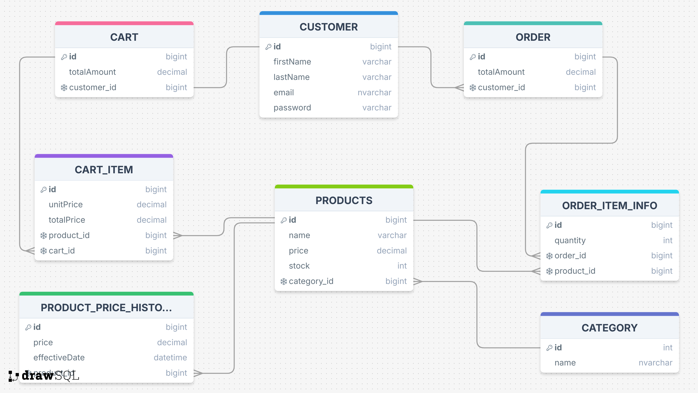

# Smart Shop Backend Project

## Overview

This project is an e-commerce backend system built with Spring Boot. It handles customer, cart, product, and order management. It includes features like tracking product stock, maintaining order history, and real-time cart management. The system is designed to ensure data integrity and offer a seamless experience for managing e-commerce workflows.

## Features

#### 1. Customer Management

* A customer can have one cart and multiple orders.
* Customer details are securely stored and managed.

#### 2. Cart Management
* Customers can add products to their cart, remove them, or update quantities.
* The cart's total price is automatically updated with every change.
* Cart contents and pricing can be retrieved and cleared.

#### 3. Order Management
* Customers can place orders from their cart.
* Once an order is placed, stock is deducted, and the order's total price is recorded.
* Orders keep a history of product prices, ensuring that the price at the time of purchase is retained.

#### 4. Product Management
* Products have stock levels, names, and prices.
* Stock is validated during order placement to ensure that items are available.
* Products can be updated, and historical price changes are recorded in a separate table.

#### 5. Historical Price Tracking
* A dedicated table `ProductPriceHistory` tracks the price changes of products over time.
* Orders reference this table to maintain accurate historical pricing information.

## Tech Stack

* **Java 17**
* **Spring Boot**
* **Spring Data JPA**
* **Hibernate**
* **H2 Database** (in-memory database for testing and development)
* **Lombok**
* **MapStruct** (for DTO mapping)
* **Maven**

## Database Design

### BaseEntity
- Shared fields for all tables:
    - `id`: Unique identifier for all records.
    - `createdAt`: Timestamp of record creation.
    - `updatedAt`: Timestamp of last record update.

### Entities
1. **Customer**
    - Stores customer information.
    - A customer can have one `Cart` and multiple `Order` records.
   

2. **Cart**
    - Each customer has one cart for temporary product storage.
    - Contains a `totalAmount` field for the cart's total price.
   

3. **CartItem**
    - Represents individual items in a cart.
    - Tracks `quantity` and `totalPrice` for each item.
   

4. **Order**
    - Tracks finalized orders for customers.
    - Links customers to their order history.
   

5. **OrderItem**
    - Stores individual product details within an order.
    - Includes `quantity` and `price` information for each product.

6. **Product**
    - Contains product details such as `name`, `price`, and `stock`.
    - Tracks product availability and category.
   

7. **ProductPriceHistory**
    - Maintains historical pricing data for products.
    - Ensures orders reflect the price at the time of purchase.
   



- The above diagram represents the database structure for the project.
- It includes entities like `Customer`, `Cart`, `Order`, and `Product`.

## Endpoints

## How to Run

### Clone the Repository
```bash
git clone https://github.com/cagataykayakiran/Smart-Shop
cd Smart-Shop
````

## Build the Project
```bash
mvn clean install
````

## Run the Application
```bash
mvn spring-boot:run
````

## Access H2 Console (For Testing)
* Navigate to: http://localhost:8080/api/v1/h2-console
* Database URL: `jdbc:h2:mem:smart-shop`

## API Documentation
* If Swagger is integrated, visit: http://localhost:8080/api/v1/swagger-ui.html
